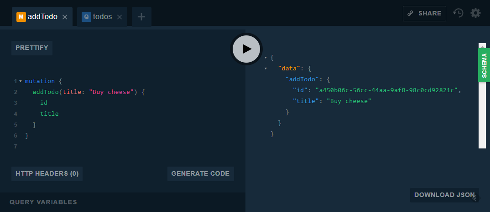

# TodoCQRS - TodoMVC using CQRS and event sourcing

[](https://dev.azure.com/fantasticfiasco/Todo%20CQRS/_build/latest?definitionId=2)

## Table of contents

- [Introduction](#introduction)
- [What you will end up with](#what-you-will-end-up-with)
- [Acceptance criteria](#acceptance-criteria)
- [Implementations](#Implementations)

## Introduction

This repository contains various implementations meeting the acceptance criteria of [TodoMVC](http://todomvc.com/), built using CQRS and event sourcing. It starts with a very basic in-memory event store, but then gradually becomes more complex with increasing requirements.

These are the implementations, ordered according to complexity:

1. [Single process using in-memory event store and in-memory read model](#single-process-using-in-memory-event-store-and-in-memory-read-model)
1. [Single process using SQL event store and in-memory read model](#single-process-using-sql-event-store-and-in-memory-read-model)
1. [Single process using NoSQL event store and in-memory read model](#single-process-using-nosql-event-store-and-in-memory-read-model)
1. [Single process using NoSQL event store and NoSQL read model](#single-process-using-nosql-event-store-and-nosql-read-model)

## What you will end up with

All implementations will expose the same GraphQL playground on [http://localhost:8080/ui/playground](http://localhost:8080/ui/playground). Using the playground you will be able to query and mutate state using GraphQL, as shown below.




## Acceptance criteria

### Empty list can have item added

Given an empty Todo list<br/>
When I add a Todo for 'Buy cheese'<br/>
Then only that item is listed

### Empty list can have two items added

Given an empty Todo list<br/>
When I add Todos for 'Buy cheese' & 'Wash the car'<br/>
Then only those items are listed

### Item completion changes the list

Given a Todo list with items 'Buy cheese' & 'Wash the car'<br/>
When the first item is marked as complete<br/>
Then only those items are listed<br/>
And only the second item is listed as incomplete

### Item incompletion changes the list

Given a Todo list with items 'Buy cheese' & 'Wash the car'<br/>
And the first item is completed<br/>
When the first item is marked as incomplete<br/>
Then only those items are listed<br/>
And both items are listed as incomplete

### Incomplete items can be removed

Given a Todo list with a single item 'Buy cheese'<br/>
When the item is removed<br/>
Then nothing is listed

### Complete items can be removed

Given a Todo list with a single item 'Buy cheese'<br/>
And the item is completed<br/>
When the item is removed<br/>
Then nothing is listed

### Editing can change the text of an item

Given a Todo list with a single item 'Buy cheese'<br/>
When the item changed to 'Apply for 6-month tax extension'<br/>
Then only the revised item is listed

## Implementations

Before running any of the implementations, please make sure [Docker](https://www.docker.com/community-edition#/download) and [Docker Compose](https://docs.docker.com/compose/install) are installed.

### Single process using in-memory event store and in-memory read model

#### Requirements

- **State must be strongly consistent, i.e. changes introduced by commands must immediately be reflected in the read model**
- **State does not need to be durable, we can accept losing it given application termination**

#### Solution

The code needed to fulfill the requirements can be found in `1.InMemoryEventStore.InMemoryReadModel.sln`. It contains a very basic in-memory event store that holds all published events.

The read model is also held in memory, in the same process as the event store. This allows us to be strongly consistent, but also decreases reliability because if the process is terminated, not only are commands prevented from being processed, the read model also becomes unavailable.

#### Running the application

Run the following command in the root of the repository to start the application.

```bash
$ docker-compose -f ./docker-compose.1.in-memory-event-store.in-memory-readmodel.yml up
```

The GraphQL playground is available on [http://localhost:8080/ui/playground](http://localhost:8080/ui/playground).

### Single process using SQL event store and in-memory read model

#### Requirements

- State must be strongly consistent, i.e. changes introduced by commands must immediately be reflected in the read model
- **State must be durable, we must retain it even if application is terminated**
- **It is acceptable that state is rebuilt using some manual process after application termination, since it isn't mission critical**

#### Solution

The code needed to fulfill the requirements can be found in `2.SqlEventStore.InMemoryReadModel.sln`. It has replaced the in-memory event store with one that persists events in a [PostgreSQL](https://www.postgresql.org/) database, thus living up to the requirements of being durable.

The read model is still being held in memory, in the same process as the event store. This allows us to be strongly consistent, but also decreases reliability because if the process is terminated, not only are commands prevented from being processed, the read model also becomes unavailable.

All evens will have to be manually replayed after application termination to get the current state of the application, all according to the requirements.

#### Running the application

Run the following command in the root of the repository to start the application.

```bash
$ docker-compose -f ./docker-compose.2.sql-event-store.in-memory-readmodel.yml up
```

The GraphQL playground is available on [http://localhost:8080/ui/playground](http://localhost:8080/ui/playground).

[Adminer](https://www.adminer.org/), a graphical database interface, is available on [http://localhost:8081](http://localhost:8081), where the following information is entered to view the PostgreSQL database.

- System: `PostgreSQL`
- Server: `sql`
- Username: `root`
- Password: `secret`

### Single process using NoSQL event store and in-memory read model

#### Requirements

- State must be strongly consistent, i.e. changes introduced by commands must immediately be reflected in the read model
- State must be durable, we must retain it even if application is terminated
- It is acceptable that state is rebuilt using some manual process after application termination, since it isn't mission critical
- **Since the state isn't relational by nature, the solutions architect has deemed a relational database to be inappropriate, and requires the usage of a NoSQL document database**

#### Solution

The code needed to fulfill the requirements can be found in `3.NoSqlEventStore.InMemoryReadModel.sln`. It has replaced the SQL event store with one that persists events in a [MongoDB](https://www.mongodb.com/) document database, thus living up to the requirements of being NoSQL.

The read model is still being held in memory, in the same process as the event store. This allows us to be strongly consistent, but also decreases reliability because if the process is terminated, not only are commands prevented from being processed, the read model also becomes unavailable.

All evens will have to be manually replayed after application termination to get the current state of the application, all according to the requirements.

#### Running the application

Run the following command in the root of the repository to start the application.

```bash
$ docker-compose -f ./docker-compose.3.no-sql-event-store.in-memory-readmodel.yml up
```

The GraphQL playground is available on [http://localhost:8080/ui/playground](http://localhost:8080/ui/playground).

[Mongo Express](https://github.com/mongo-express/mongo-express), a graphical database interface, is available on [http://localhost:8081](http://localhost:8081).

### Single process using NoSQL event store and NoSQL read model

#### Requirements

- State must be strongly consistent, i.e. changes introduced by commands must immediately be reflected in the read model
- State must be durable, we must retain it even if application is terminated
- **State must automatically be available on restart after application termination**
- Since the state isn't relational by nature, the solutions architect has deemed a relational database to be inappropriate, and requires the usage of a NoSQL document database

#### Solution

The code needed to fulfill the requirements can be found in `4.NoSqlEventStore.NoSqlReadModel.sln`. It has replaced the in-memory read model with one that persists todo items in a [MongoDB](https://www.mongodb.com/) document database, thus living up to the requirements of being available after application restart.

The read model is still being served by the same process as the event store. This allows us to be strongly consistent, but also decreases reliability because if the process is terminated, not only are commands prevented from being processed, the read model also becomes unavailable.

#### Running the application

Run the following command in the root of the repository to start the application.

```bash
$ docker-compose -f ./docker-compose.4.no-sql-event-store.no-sql-readmodel.yml up
```

The GraphQL playground is available on [http://localhost:8080/ui/playground](http://localhost:8080/ui/playground).

[Mongo Express](https://github.com/mongo-express/mongo-express), a graphical database interface, is available on [http://localhost:8081](http://localhost:8081).
