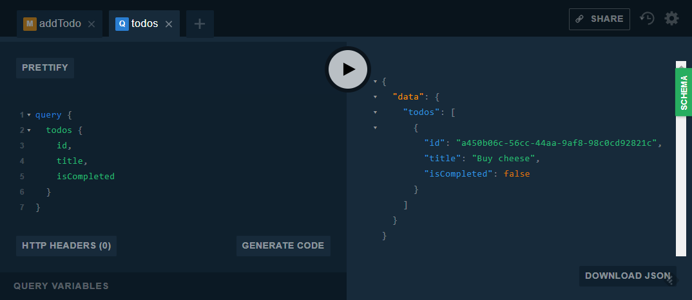

# TodoCQRS - TodoMVC using CQRS and event sourcing

[](https://dev.azure.com/fantasticfiasco/Todo%20CQRS/_build/latest?definitionId=2)

## Table of contents

- [Introduction](#introduction)
- [Running the application](#running-the-application)
- [Acceptance criteria](#acceptance-criteria)

## Introduction

This is a very basic implementation of the acceptance criteria defined by TodoMVC, implemented using CQRS and event sourcing. Currently only a in-memory implementation of the event store exists, but there is nothing preventing you from implementing one using a SQL database or [Event Store](https://eventstore.org/).

## Running the application

Make sure [Docker](https://www.docker.com/community-edition#/download) and [Docker Compose](https://docs.docker.com/compose/install) is installed before running the following command in the root of the repository:

```bash
$ docker-compose up
```

Access the GraphQL playground by hitting [http://localhost:8080/ui/playground](http://localhost:8080/ui/playground) in your favorite web browser.




## Acceptance criteria

### Empty list can have item added

Given an empty Todo list<br/>
When I add a Todo for 'Buy cheese'<br/>
Then only that item is listed

### Empty list can have two items added

Given an empty Todo list<br/>
When I add Todos for 'Buy cheese' & 'Wash the car'<br/>
Then only those items are listed

### Item completion changes the list

Given a Todo list with items 'Buy cheese' & 'Wash the car'<br/>
When the first item is marked as complete<br/>
Then only those items are listed<br/>
And only the second item is listed as active

### Item incompletion changes the list

Given a Todo list with items 'Buy cheese' & 'Wash the car'<br/>
And the first item is completed<br/>
When the first item is marked as incomplete<br/>
Then only those items are listed<br/>
And both items are listed as active

### Incomplete items can be removed

Given a Todo list with a single item 'Buy cheese'<br/>
When the item is removed<br/>
Then nothing is listed

### Complete items can be removed

Given a Todo list with a single item 'Buy cheese'<br/>
And the item is completed<br/>
When the item is removed<br/>
Then nothing is listed

### Editing can change the text of an item

Given a Todo list with a single item 'Buy cheese'<br/>
When the item changed to 'Apply for 6-month tax extension'<br/>
Then only the revised item is listed
